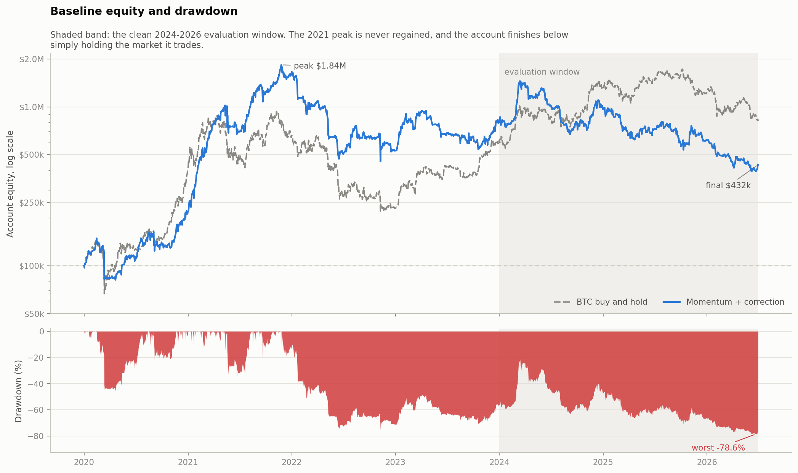
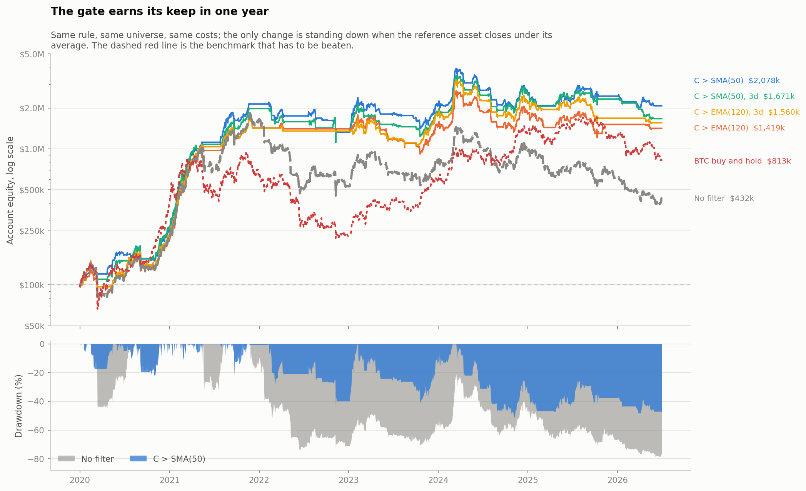
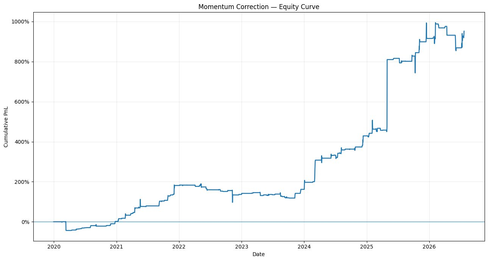
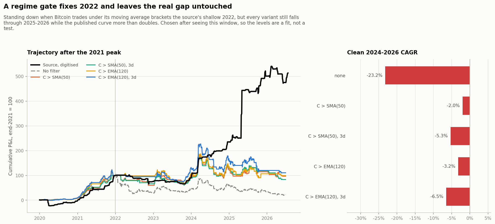

# Momentum-Correction Strategy

Does "buy strong momentum, but only on a correction" work on crypto? A trader
published the idea and an equity curve ending near 950% cumulative P&L. This
repository writes the rule down as mathematics, freezes it, tests it on seven
years of Binance data, and reports what happened.

Short answer: no. The rule made money in absolute terms over the full sample
and still returned less than half of what holding Bitcoin returned over the
same window, at a deeper drawdown. Adjusted for the market exposure it does
take, its alpha is statistically indistinguishable from zero. It lost money
over the last two and a half years, and the published curve was not
reproduced.

## What the run found

Frozen baseline, 2020-01-01 to 2026-06-30, cash only, 10 bps each side:

| | Full sample | Clean restart, 2024 onward |
|---|---:|---:|
| Total return | +331.97% | -48.29% |
| CAGR | 25.27% | -23.23% |
| Maximum drawdown | -78.61% | -72.94% |
| Profit factor | 1.03 | 0.90 |
| **BTC buy and hold, same window** | **+714.14%** | **+32.70%** |

3,177 trades from 6,665 orders, so 47.7% of orders ever filled. 48.0% of the
fills were profitable.



The peak is November 2021 and it is never regained.

Five results matter more than the headline.

**It does not beat buy and hold.** Holding Bitcoin over the same window
returned +714% at a -76.6% drawdown and a 0.84 Sharpe, against the strategy's
+332%, -78.6% and 0.69. The rule holds cash about half the time, so a raw
comparison is unfair to it; regressing its daily returns on the benchmark gives
a beta of 0.57 and an annualised alpha of +9.9% with a t-statistic of 0.56.
That is not distinguishable from zero. What looks like a strategy is a diluted
long position.

**Waiting for the correction is not the edge.** Resting the same limits on the
whole liquid universe, with no momentum filter at all, returns 27.46% a year
against the baseline's 25.27%, and loses less on the clean restart (-16.07%
against -23.23%). The top-quintile momentum rank is not what produces the
curve.

**The result does not survive its own parameter grid.** Of the sixteen
predeclared combinations of correction depth and holding period, seven earn a
positive return on the clean restart. The frozen cell is not one of them.

**The edge is inside the spread.** At zero cost the rule compounds at 37.19% a
year. At the baseline 25 bps round trip, 25.27%. At 100 bps, it loses money.
Break-even sits near 85 bps, which a retail taker account can reach.

**The sample is too small to tell.** A 30-day moving-block bootstrap of the
evaluation window puts the 95% interval on annual return between -60.9% and
+51.8%, with 78.6% of resampled paths ending flat or down.

## What did not rescue it

Three follow-up questions, each with its own section in the report.

**Finer execution data.** The daily proxy cannot see when inside a day a limit
filled, so it schedules the exit from the calendar. At a one-day hold that
error is the entire holding period. Re-running with hourly bars and exits
scheduled exactly 24 hours after the observed fill moves the one-day result by
16 points and the ten-day result by 3, in opposite directions, which is what
the mechanism predicts. Every holding period still loses on the clean restart.

**A market regime filter.** The author publishes one elsewhere: buy BTC when
the close is above its 50-day moving average. Gating the whole book on it, so
that no order is placed and resting orders are pulled while the gate is shut,
changes the account more than any other single decision tested here.



The gated and ungated books track each other through 2020 and 2021, ending that
year within 32% of one another. Across 2022 the ungated book falls from $1.62M
to $0.53M while the gated books hold between $1.33M and $1.41M, and the gap
never closes. The gate does not trade better. It declines to trade at all
through the one year that destroys the ungated book.

| Gate | Days in market | Full sample | Max drawdown | Clean restart |
|---|---:|---:|---:|---:|
| None, the frozen baseline | 100% | +332% | -78.6% | -23.2% |
| C > SMA(50), the author's rule | 52% | +1978% | -51.7% | -2.0% |
| C > SMA(50), confirmed 3 days | 48% | +1571% | -52.3% | -5.3% |
| C > EMA(120) | 58% | +1319% | -54.6% | -3.2% |
| C > EMA(120), confirmed 3 days | 55% | +1460% | -51.9% | -6.5% |

Two things to keep in view. The clean restart is still negative at every
setting. And the gate was chosen after that window was already known, so -2.0%
is a fit rather than a test, resting on a single bear market.

**Matching the published chart.** This is what the author posted:



Reading it by eye invites the interpretation you want, so it was digitised
instead. Calibrated against the gridlines it starts at +2%, peaks at +996% and
ends at +955%, and it is flat 73% of the time. Year-end values come out at -3,
183, 139, 164, 431, 917 and 940 points.

The 2022 stretch is the tell. The source gives back 44 points that year while
an always-in-the-market version of these rules loses 67% of equity. Something
held the author's losses down, and the regime gate is a plausible candidate: it
brackets the source's give-back, which the ungated rule misses by a factor of
three.

The author was not sitting in cash, though. The curve still moves on 20% of its
columns through 2022, so trades kept happening at about a fifth of the 2021
pace. That is close to the 15% the SMA(50) gate produces and nowhere near the
2% of the EMA(120) variants, which fit the P&L better but shut the book almost
completely. On the evidence of trading frequency, which is not what the gate
was selected on, the author's own published average is the better candidate.



Every series is rescaled to its own end-2021 level, because the source plots
additive P&L on unknown capital while this project compounds. Only the
trajectory after that point is comparable.

Read left to right, the gated variants sit close to the source through 2022 and
2023, which is the part the filter explains. Then the source leaves. From
end-2024 it gains 118% while every variant here falls between 22% and 36%.
Standing down in bear markets is evidently part of the author's process, and it
is not what separates this reconstruction from his result.

## Reading this repository

| File | What it holds |
|---|---|
| [results/report.md](results/report.md) | The report, with all fourteen figures |
| [SOURCE.md](SOURCE.md) | What the source published, what it left open, and the chart measured rather than described |
| [AUDIT.md](AUDIT.md) | Look-ahead, survivorship, accounting and statistics review |
| Sections 1 to 11 below | The specification, frozen before any data was downloaded |

The specification came first. Nothing in it was edited after the results
existed, which is the only reason the parameters can be called predeclared
rather than fitted. Sections 12 to 14 were added later and describe work that
followed from the results; they are labelled as such.

Nothing here is investment advice, and nothing here is ready for live capital.
The report ends with the gate that would have to be passed first.

## Running it

```bash
python -m pip install -r requirements.txt
make test
make download parse backtest
```

That writes `results/report.md` and every figure beside it. Expect a few hours
for the download; the archive is roughly 24,000 monthly files.

The hourly and funding sections need local mirrors of the venue archives, and
fold their results into the same directory:

```bash
export MOMENTUM_CORRECTION_HOURLY_DIR=/path/to/hourly/parquet
export MOMENTUM_CORRECTION_FUNDING_DIR=/path/to/fundingRate
make intraday-cache intraday
```

```
momentum-correction/
  README.md      this file: results, then the frozen specification
  SOURCE.md      the source, and the boundary of what it published
  AUDIT.md       the review
  engine.py      features, simulation, performance
  scripts/       pipeline stages, one concern each
  results/       one report, its figures, and the tables behind them
  docs/          the source charts, cited and digitised
```

## Data

Binance Spot, USDT pairs, from the public archive rather than the current
symbol list, so pairs that were later delisted stay in history. 599 symbols,
24,435 checksum-verified monthly files, 2019-10 through 2026-06. 171 of those
symbols stop trading before the end of the sample and 13.7% of all trades are
in names that later disappeared, which is what makes the run free of
survivorship bias.

## The frozen specification

Written before data acquisition. The source post gives the logic but not its
parameters, sizing, execution rules, or code, so every explicit choice below is
a research hypothesis rather than a claim about what the author did.

## 1. Baseline parameters

Use UTC daily signal bars and intraday trades or quotes for execution:

\[
\theta=(N_V,L_V,L_m,L_\sigma,q_m,\kappa,J,H,\rho,\bar\rho)
\]

with

| Parameter | Baseline | Meaning |
|---|---:|---|
| \(N_V\) | 50 | number of coins selected by trailing volume |
| \(L_V\) | 30 | volume-ranking lookback in complete days |
| \(L_m\) | 20 | momentum lookback in complete days |
| \(L_\sigma\) | 20 | realized-volatility lookback |
| \(q_m\) | 0.80 | cross-sectional momentum percentile |
| \(\kappa\) | 1.0 | correction depth in daily-volatility units |
| \(J\) | 3 | limit-order life in days |
| \(H\) | 5 | holding period in days |
| \(\rho\) | 10% | maximum capital reserved per coin |
| \(\bar\rho\) | 100% | maximum total reserved plus invested capital |

One parameter vector must be selected before the final test period. A
predeclared robustness grid may vary one dimension at a time:

\[
L_m\in\{10,20,60\},\qquad
\kappa\in\{0.5,1.0,1.5,2.0\},\qquad
H\in\{1,3,5,10\}.
\]

Every grid cell is reported. The best historical cell is not relabeled as
the baseline.

## 2. Point-in-time universe

The baseline venue is Binance Spot and the quote asset is USDT. At the end
of day \(t\), define trailing quote volume

\[
V_{u,t}
=
\sum_{j=0}^{L_V-1}\operatorname{QuoteVolume}_{u,t-j}.
\]

Let \(\mathcal U_t\) be the \(N_V\) pairs with the largest \(V_{u,t}\) among
pairs that, using information available at \(t\):

- were listed throughout the required signal lookback;
- are actively tradable against USDT;
- represent a non-stablecoin underlying;
- are not leveraged-token, index, or wrapped duplicates.

Current listings must never be projected backward. Delisted pairs remain in
historical universes. Quote volume from day \(t\) is usable only after its
bar closes, and orders activate strictly after that close.

Let \(C_{u,t}\) be the close and

\[
r_{u,t}=\log\frac{C_{u,t}}{C_{u,t-1}}.
\]

## 3. Momentum signal

Using only complete bars through \(t\), estimate daily volatility:

\[
\widehat\sigma_{u,t}
=
\sqrt{
\frac{1}{L_\sigma-1}
\sum_{j=0}^{L_\sigma-1}
\left(r_{u,t-j}-\bar r_{u,t}\right)^2
},
\qquad
\bar r_{u,t}
=
\frac1{L_\sigma}
\sum_{j=0}^{L_\sigma-1}r_{u,t-j}.
\]

Define volatility-normalized momentum

\[
m_{u,t}
=
\frac{\log(C_{u,t}/C_{u,t-L_m})}
{\widehat\sigma_{u,t}\sqrt{L_m}}.
\]

Let \(p_{u,t}\) be the percentile rank of \(m_{u,t}\) within
\(\mathcal U_t\). The signal is

\[
I_{u,t}
=
\mathbf 1\{m_{u,t}>0\}
\mathbf 1\{p_{u,t}\ge q_m\}.
\]

The first condition requires positive time-series momentum. The second keeps
only the strongest cross-sectional momentum. Define the monotone signal
strength

\[
a_{u,t}=I_{u,t}m_{u,t}.
\]

This formalizes the source statement that stronger momentum is a stronger
signal without treating the least-bad coin in a falling market as a winner.

## 4. Correction limit and fill

For each new signal, compute the unrounded buy limit

\[
\widetilde L_{u,t}
=
C_{u,t}\exp\left(-\kappa\widehat\sigma_{u,t}\right)
\]

and round down to the valid venue tick \(\delta_{u,t}\):

\[
L_{u,t}
=
\delta_{u,t}
\left\lfloor
\frac{\widetilde L_{u,t}}{\delta_{u,t}}
\right\rfloor.
\]

The requested log correction in volatility units is approximately

\[
d_{u,t}
=
\frac{\log(C_{u,t}/L_{u,t})}{\widehat\sigma_{u,t}}
\approx\kappa.
\]

The order is active after close \(t\) and expires after \(J\) complete daily
bars. Let \(S_u(s)\) be the timestamped trade price. Its first possible fill
time is

\[
\tau_{u,t}
=
\inf\left\{
s\in(t,t+J\text{ days}]:
S_u(s)<L_{u,t}
\right\}.
\]

The strict trade-through condition is the baseline because a print exactly
at the limit does not prove that the strategy's queue position filled. The
fill price is conservatively set to

\[
P^{\mathrm{in}}_{u,t}=L_{u,t},
\]

even if the market trades lower. A separate optimistic sensitivity may use
touch fills; it must not replace the baseline.

Before a fill, cancel the order when:

- \(J\) days elapse;
- a later completed daily bar no longer satisfies the momentum signal;
- the pair leaves the eligible universe or becomes untradable;
- its reserved capital is no longer valid under a venue rule.

There is at most one active order or open position per coin. A new signal
does not move an existing limit and does not reset its expiry.

If only OHLC bars are available, a bar with
\(\operatorname{Low}<L_{u,t}\) may proxy a trade-through. Such a run is
labeled a bar-fill approximation; it cannot establish queue execution.

## 5. Capital reservation and sizing

Let \(E_t\) be marked portfolio equity and \(A_t\) the capital available
after existing positions and active orders. New orders reserve cash when
they are placed, so later fills cannot create hindsight leverage.

For the new signal set

\[
\mathcal C_t
=
\{u\in\mathcal U_t:I_{u,t}=1,\ u\text{ has no order or position}\},
\]

allocate the available reservation budget \(R_t\) by frozen momentum
strength:

\[
R_{u,t}^{*}
=
R_t
\frac{a_{u,t}}{\sum_{v\in\mathcal C_t}a_{v,t}},
\qquad
R_t
=
\min\left(
A_t,\,
\max\left[
0,\,
\bar\rho E_t-\text{capital already reserved or invested}
\right]
\right).
\]

Cap each order and redistribute any excess repeatedly among uncapped
candidates:

\[
0\le R_{u,t}\le\rho E_t,\qquad
\sum_{u\in\mathcal C_t}R_{u,t}\le R_t.
\]

For taker-or-worse entry fee rate \(f^{\mathrm{in}}_{u,t}\) and quantity step
\(\Delta q_{u,t}\), choose

\[
q_{u,t}
=
\Delta q_{u,t}
\left\lfloor
\frac{R_{u,t}}
{\Delta q_{u,t}L_{u,t}(1+f^{\mathrm{in}}_{u,t})}
\right\rfloor.
\]

The order is skipped when this rounds to zero or breaches the venue's
minimum notional. Unfilled and canceled orders release their reservation.
The baseline is cash-only: no leverage, borrowing, shorting, or assumed
yield on idle cash.

## 6. Exit and exact P&L

For a fill at timestamp \(\tau_{u,t}\), schedule the exit after exactly
\(H\) 24-hour periods:

\[
\xi_{u,t}=\tau_{u,t}+H\cdot24\text{ hours}.
\]

Execute a marketable sell against the first valid bid at or after
\(\xi_{u,t}\). Let \(P^{\mathrm{out}}_{u,t}\) be its volume-weighted fill
after walking the recorded book. If only top-of-book data are available,
cap quantity by displayed bid size or apply a separately reported slippage
model. Never substitute a midpoint or candle close in an executable run.

There is no stop, profit target, scale-in, or re-entry before exit. A later
signal may create a new order only after the prior position closes.

With explicit entry and exit costs \(c^{\mathrm{in}}_{u,t}\) and
\(c^{\mathrm{out}}_{u,t}\), trade P&L is

\[
\Pi_{u,t}
=
q_{u,t}
\left(P^{\mathrm{out}}_{u,t}-P^{\mathrm{in}}_{u,t}\right)
-c^{\mathrm{in}}_{u,t}-c^{\mathrm{out}}_{u,t}.
\]

Return on reserved capital is

\[
r^R_{u,t}=\frac{\Pi_{u,t}}{R_{u,t}}.
\]

Portfolio equity is marked at executable bid:

\[
E_s
=
\text{cash}_s
+\sum_{(u,t)\in\mathcal P_s}
q_{u,t}B_u(s),
\]

where \(\mathcal P_s\) is the set of open positions. Reserved cash for
unfilled orders remains cash, not exposure.

## 7. Quant trading hypothesis

Define the entry event

\[
\mathcal A_{u,t}(\kappa)
=
\{I_{u,t}=1,\ \tau_{u,t}<\infty\}.
\]

The strategy combines two conditional effects:

\[
\underbrace{m_{u,t}>0}_{\text{medium-horizon continuation}}
\quad+\quad
\underbrace{S_u(\tau)<L_{u,t}}_{\text{short-horizon correction}}.
\]

Its gross directional hypothesis is

\[
\mu(m,\kappa,H)
=
\mathbb E
\left[
\frac{P^{\mathrm{out}}_{u,t}}
{P^{\mathrm{in}}_{u,t}}-1
\;\middle|\;
\mathcal A_{u,t}(\kappa),\,m_{u,t}=m
\right]
>0.
\]

Positive executable expectancy requires more:

\[
\mathbb E[\Pi_{u,t}\mid\mathcal A_{u,t}(\kappa)]>0,
\]

and the corresponding normalized conditional edge is

\[
\mathbb E
\left[
\frac{P^{\mathrm{out}}_{u,t}}
{P^{\mathrm{in}}_{u,t}}-1
-
\frac{c^{\mathrm{in}}_{u,t}+c^{\mathrm{out}}_{u,t}}
{q_{u,t}P^{\mathrm{in}}_{u,t}}
\;\middle|\;
\mathcal A_{u,t}(\kappa),\,m_{u,t}=m
\right]
>0.
\]

Equivalently at a fixed \(m\), the gross conditional return must exceed
normalized costs:

\[
\mu(m,\kappa,H)
>
\mathbb E
\left[
\frac{c^{\mathrm{in}}_{u,t}+c^{\mathrm{out}}_{u,t}}
{q_{u,t}P^{\mathrm{in}}_{u,t}}
\;\middle|\;
\mathcal A_{u,t}(\kappa),\,m_{u,t}=m
\right].
\]

Shallow limits primarily condition on pre-existing momentum. Deep limits
condition on a larger adverse move and therefore add a stronger reversal
hypothesis. Deeper is not mechanically better: fill probability falls,
capital stays idle longer, and the conditional set contains more failed
trends. The source's monotonic claim must be tested rather than assumed.

## 8. Identification and controls

Separate the two components with identical universes, dates, sizing, exits,
and cost assumptions:

1. **Full rule:** momentum filter plus correction limit.
2. **Momentum only:** same signal, marketable entry when the order would
   activate.
3. **Correction only:** same limit construction without the momentum rank.
4. **Unconditional:** entry dates sampled from eligible coin-days and
   matched on coin, volatility, and market regime.
5. **Passive-limit control:** same limit distance on all eligible coins,
   measuring whether apparent alpha is merely the generic economics of
   resting bids.

Report the full rule's incremental P&L over each control. Do not compare
only terminal equity curves.

The ordered source claims are evaluated without selecting the best bin:

\[
r^R_{u,t}
=
\alpha
+\beta_m m_{u,t}
+\beta_d d_{u,t}
+\beta_{md}m_{u,t}d_{u,t}
+\gamma^\top Z_{u,t}
+\varepsilon_{u,t},
\]

where \(Z\) is predeclared and may contain market return, market volatility,
coin volatility, volume rank, spread, and calendar effects. Standard errors
are clustered by entry date; block bootstrap samples preserve serial and
cross-coin dependence.

## 9. Evaluation protocol

The primary result is fixed-capital, cash-only net portfolio P&L under
executable assumptions. Report:

- signal, order, trade-through, fill, cancel, and exit counts;
- fill rate and capital utilization;
- time to fill and realized holding time;
- gross and net P&L, mean and median return, hit rate, average win/loss,
  profit factor, and turnover;
- compound return, maximum drawdown, and drawdown duration;
- expected shortfall at 90%, 95%, and 99%, with observation counts;
- profit concentration in the best 1%, 5%, and 10% of trades;
- results by coin, year, market regime, momentum strength, and correction
  depth;
- full-rule results beside every identification control;
- touch-fill, trade-through, fee, slippage, and latency sensitivities.

Use an expanding-window or fixed train/validation/test split. Parameters and
all filters are frozen before the final test. Simultaneous coin trades are
one correlated portfolio event, not independent observations.

## 10. Pre-analysis invariants

- Universe membership and volume rank are point-in-time.
- Signals use only complete bars available before order activation.
- Delisted coins and failed histories remain in the sample.
- Stablecoins and token duplicates are excluded by a versioned rule.
- Orders reserve capital at placement, not retrospectively at fill.
- A limit touch does not imply a baseline fill; the price must trade through.
- No fill receives favorable price improvement without order-book evidence.
- Entry and exit use venue-valid ticks, steps, minimums, and contemporaneous
  fees.
- Missing or stale execution data cause a skip or explicitly delayed exit,
  never a favorable model price.
- A missing scheduled exit in the daily-bar research run receives zero
  recovery rather than a stale last price.
- Equity and drawdown include open-position liquidation value and idle cash.
- No parameter is selected on the final test period.
- The source chart is context, not evidence: its unpublished rules and
  trades cannot be reconstructed from the image.

## 11. Implementation

The implementation keeps the research and live-preparation boundaries
explicit:

- `scripts/discover.py` enumerates all historical Binance Spot USDT pairs
  from the public S3 archive, including delisted symbols.
- `scripts/download.py` downloads every selected monthly archive and verifies
  its published SHA-256 checksum.
- `scripts/parse.py` normalizes Binance's millisecond/microsecond timestamps
  and writes one parquet file per symbol.
- `scripts/backtest.py` runs the cash-only portfolio simulation, controls,
  parameter and friction sensitivities, bootstrap, and report text.
- `scripts/figures.py` draws the report figures from the persisted outputs.
- `scripts/intraday.py` and `scripts/backtest_intraday.py` re-run the same rule
  with hour-resolution execution; `scripts/funding.py` supplies the perpetual
  funding series. See section 13.
- `scripts/benchmark.py` measures the rule against holding the market, which
  is the comparison that decides whether it is worth running.
- `scripts/regime.py` tests the market-wide gate the author publishes
  elsewhere, as a reconstruction hypothesis. See section 14.
- `scripts/source_chart.py` digitises the published equity chart so claims
  about it are measurements rather than impressions.
- `scripts/live_plan.py` reads current public market data and current exchange
  filters to create a dry-run `LIMIT_MAKER` order plan. It contains no API
  signing or order-submission code.

Run:

```bash
python -m pip install -r requirements.txt
make test
make discover download parse backtest
make live-plan
```

The historical implementation uses a strict daily-bar trade-through proxy:
`low < limit` fills at the resting limit. This is deliberately labeled a
proxy because daily klines cannot establish queue position, partial fills,
spread, or depth. Those quantities must be measured during shadow trading
before live capital is authorized.

## 12. Generated figures

`scripts/figures.py` draws all fourteen figures from the persisted outputs and
`scripts/report.py` embeds them in [the report](results/report.md), which is
where they should be read. They are not duplicated here.

The two worked-example panels need the parsed parquet bars and are skipped with
a warning when `data/parquet/` is empty. Everything else draws from the CSV
files in `results/`, so the report can be rebuilt without re-running the
simulation.

## 13. Hour-resolution execution run

The daily run cannot observe *when* inside a UTC day a limit filled, so it
schedules the exit from the calendar instead of from the fill. The realized
holding period is therefore uncertain by up to a day, tolerable at the frozen
five-day hold, and disqualifying at the one-day hold the source author's
earlier post describes, where the uncertainty is the entire holding period.

A second pipeline resolves the fill to the hour:

```bash
python scripts/intraday.py --build --source /path/to/parquet_1h
python scripts/funding.py  --build --source /path/to/fundingRate
python scripts/backtest_intraday.py --workers 8
python scripts/report.py
```

A limit fills on the first hourly bar whose low trades through it, and the
position exits at the hourly open exactly `H * 24h` after that fill.

Two boundaries apply to the result and are stated in the generated report:

- **Venue.** The hourly archive covers Binance **USD-M perpetual futures**, not
  spot. The universe, listing dates, and price series therefore differ from the
  daily spot run; the two are not the same experiment at two resolutions. The
  `execution_comparison.csv` grid re-runs the daily proxy on the *futures* data
  so the execution effect can be read without the venue change confounding it.
- **Funding.** A long perpetual pays funding when the rate is positive and
  receives it when negative. Charging it *raises* the result, because the rule
  buys into sharp corrections and those are when funding turns deeply negative.
  The receipts are concentrated in a few newly listed perpetuals on hourly
  funding at the negative cap, at sizes those books could not fill, so funding
  is excluded from the headline and attributed separately.

The finding: resolving the fill to the hour changes the one-day result the most
and the ten-day result least, exactly as the mechanism predicts, but it does not
change the verdict. Every holding period still loses money on the clean
2024-2026 restart once funding is excluded.

## 14. Reconstruction hypothesis: the regime gate

The momentum-correction post names no regime filter. Two other posts by the
same author bear on one: an earlier post mentions "a simple regime filter"
without defining it, and a later post publishes `Buy BTC if C > MA(50)` with a
chart captioned `Close > SMA(50) Timing vs Buy & Hold` costed at 10 bp per
side. `SOURCE.md` records both.

`scripts/regime.py` therefore tests a market-wide gate on a deliberately tiny
grid: the author's published average, the longer one that follows from it, and
a confirmation window of one or three days. The gate closes the whole book,
pulling resting orders as well as blocking new ones; open positions run to
their scheduled exit because the rule has no stop.

Two findings, both in the generated report:

- **It explains the flat 2022.** The ungated rule gives back 71% of its
  running total across that year against the source's 24%; the gated variants
  give back between 2% and 40%, bracketing it.
- **It does not explain the divergence that matters.** From end-2024 the
  source gains 118% while every gated variant falls between 22% and 36%.

The grid is small on purpose. The evaluation window's answer was already known
when this was proposed, so a wide search over regime parameters would fit
rather than test. Every figure in that section is post-hoc and is labelled so;
the frozen baseline is unchanged and the gate defaults to off.
