# Momentum-Correction Strategy: Research and Live-Readiness Report

Venue **Binance Spot, USDT pairs**, execution UTC daily klines. Generated from the
frozen rules in `README.md`. Status: **NOT READY, SHADOW/PAPER TRADE ONLY**.

## Executive conclusion

The backtest is suitable for deciding whether to proceed to paper trading.
It is **not** sufficient for unattended live capital. The historical run uses
daily candle trade-through as a proxy for limit fills and next-target-day
opens with modeled slippage for exits. It does not reconstruct queue
position, partial fills, historical symbol filters, spread, or book depth.

Baseline full-sample net return is **331.97%**, CAGR is
**25.27%**, and maximum drawdown is
**-78.61%**. From 2024-01-01 onward, CAGR is
**-23.23%** with maximum drawdown
**-72.94%**. These numbers are model outputs, not
expected live returns.

| Question | Answer |
|---|---|
| Does the frozen rule make money over the full sample? | Yes on paper: 331.97% net, 25.27% a year. |
| Does it make money on the clean 2024-2026 restart? | No: -23.23% a year, -72.94% drawdown. |
| Does waiting for the correction beat entering at once? | Yes over the full sample, but generic resting bids without the momentum filter do at least as well in both windows. |
| Is the full-sample result robust to its own parameters? | No: only 43.75% of predeclared cells earn a positive clean return. |
| Is it ready for live capital? | No. Shadow trading and an execution model come first. |

## How the strategy works

The rule runs once per UTC daily close and touches only Binance Spot USDT pairs.
It buys strength on weakness: rank the liquid universe by
volatility-normalized momentum, rest a buy limit one daily volatility below
the signal close, and sell a fixed five days after any fill.

Every parameter in the diagram is this project's frozen choice. The source
post publishes three rules, namely measure momentum, enter a correction with a
limit order, and exit after `X` days. It publishes none of the numbers, `X` and the
data frequency. An earlier post by the same author mentions a one-day hold,
which the predeclared grid below shows would materially change the verdict.

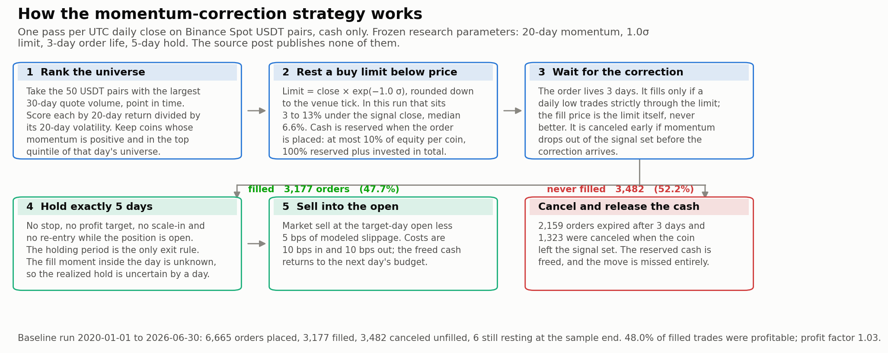

Roughly half of all orders never fill, which is the mechanism's defining
property rather than a defect: unfilled orders cost nothing but forgo the
moves that ran away without correcting. The two worked examples below are real
orders from this run: the same rule, one filled and one expired.

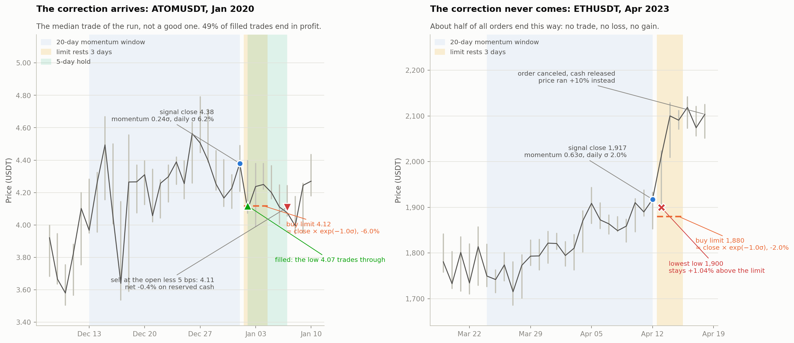

## Source-claim alignment: failed reconstruction

The linked source chart rises sharply during 2024--2026 and ends near 950%
additive cumulative P&L. This baseline returns **-48.29%**
in a clean account restarted on 2024-01-01. It therefore does **not** reproduce
the source chart and must not be presented as the author's strategy.

The exact X post leaves the momentum formula, correction threshold, holding
period `X`, order lifetime, venue, sizing, costs, and P&L aggregation
unspecified. Its chart reports "Cumulative PnL" rather than compounded account
equity. An [earlier related post](https://www.linkedin.com/posts/pavelkycek_simple-strategies-work-in-crypto-equity-activity-7372569491874136064-IDSO)
mentions a one-day hold and a simple regime filter, but does not define the
filter. The frozen baseline instead uses a five-day hold and no regime filter.

For source alignment, the predeclared one-day diagnostics are:

| Correction sigma | Clean OOS return | Clean OOS CAGR | Clean OOS max drawdown |
|---:|---:|---:|---:|
| 1.0 | 2.54% | 1.01% | -32.24% |
| 1.5 | 64.88% | 22.20% | -19.84% |
| 2.0 | 50.98% | 17.96% | -16.99% |

These results show that the holding period and correction depth can reverse
the recent-period conclusion. They do not identify the source rules. Choosing
the strongest row now would be post-selection on the evaluation period, so no
row is promoted to a live candidate.

Only **43.75%** of the predeclared
correction-depth/holding-period cells have positive clean out-of-sample
CAGR. The 30-day
block-bootstrap probability of non-positive CAGR is
**78.65%**. Profit concentration in the best 10% of trades is
**1999.98%**.

## Data and method

- Venue: Binance Spot, USDT pairs.
- Execution data: UTC daily klines.
- Archive snapshot: 2019-10 through
  2026-06.
- Historical symbols with data: 599.
- Signal: top-50 trailing-volume universe; positive, top-quintile
  20-day volatility-normalized momentum.
- Entry: resting limit one daily volatility below the signal close,
  valid for three days; the daily low must trade strictly below the limit.
- Exit proxy: target-day open after five days, less 5 bps slippage.
- Baseline costs: 10 bps maker entry fee and 10 bps taker exit fee.
- Sizing: cash-only, 10% per coin, 100% aggregate reserved plus invested.

Binance documents the archive's kline schema and checksum files in its
[public-data repository](https://github.com/binance/binance-public-data).
Current live orders must obey the current `PRICE_FILTER`, `LOT_SIZE`, and
notional filters from
[official Spot API filters](https://github.com/binance/binance-spot-api-docs/blob/master/filters.md).

## Strategy and controls

| Strategy | Total return | CAGR | Max drawdown | Sharpe | Trades | Fill rate |
|---|---:|---:|---:|---:|---:|---:|
| Momentum + correction | 331.97% | 25.27% | -78.61% | 0.69 | 3177 | 47.67% |
| Momentum, next-open entry | -16.57% | -2.75% | -98.70% | 0.36 | 5341 | 99.93% |
| Positive momentum + correction | 104.98% | 11.69% | -86.26% | 0.49 | 7546 | 50.98% |
| Passive correction limits | 383.39% | 27.46% | -66.12% | 0.72 | 13227 | 53.58% |

The next-open momentum control identifies whether waiting for the correction
adds value. The broader positive-momentum and passive-limit controls test
whether the result is driven by the top-quintile rule or by generic resting
bids.

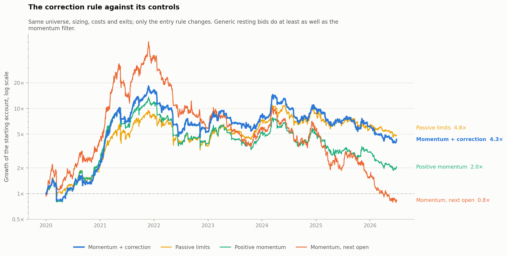

Yes over the full sample, but generic resting bids without the momentum filter do at least as well in both windows. Read the two windows together: a filter that only helps in
the window that also contains the bull market is not evidence of a filter that
works.

### Clean 2024-2026 evaluation

Each control restarts with $100,000 and no positions on 2024-01-01:

| Strategy | Total return | CAGR | Max drawdown | Trades | Profit factor |
|---|---:|---:|---:|---:|---:|
| Momentum + correction | -48.29% | -23.23% | -72.94% | 1193 | 0.90 |
| Momentum, next-open entry | -89.47% | -59.45% | -93.11% | 1960 | 0.79 |
| Positive momentum + correction | -61.35% | -31.69% | -76.01% | 2678 | 0.84 |
| Passive correction limits | -35.39% | -16.07% | -57.86% | 5180 | 0.93 |

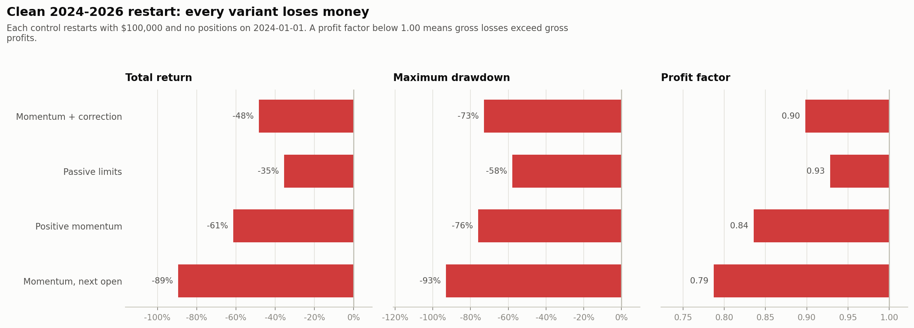

## Against buy and hold

Every return above is absolute. The question that decides whether the rule is
worth running is relative: over the same window, holding the market it trades
returned 714.14% at a -76.63%
drawdown.

| Full sample | Total return | CAGR | Max drawdown | Sharpe | Beta | Alpha | t |
|---|---:|---:|---:|---:|---:|---:|---:|
| BTC buy and hold | 714.14% | 38.11% | -76.63% | 0.84 | 1.00 | | |
| Momentum + correction | 331.97% | 25.27% | -78.61% | 0.69 | 0.57 | 9.89% | 0.56 |
| Momentum + correction, SMA(50) gate | 1978.37% | 59.55% | -51.71% | 1.28 | 0.31 | 40.49% | 2.60 |

| Clean 2024-2026 | Total return | CAGR | Max drawdown | Sharpe | Beta | Alpha | t |
|---|---:|---:|---:|---:|---:|---:|---:|
| BTC buy and hold | 32.70% | 12.01% | -52.97% | 0.47 | 1.00 | | |
| Momentum + correction | -48.29% | -23.23% | -72.94% | -0.35 | 0.55 | -28.37% | -1.19 |
| Momentum + correction, SMA(50) gate | -4.81% | -1.96% | -51.71% | 0.14 | 0.36 | -3.18% | -0.15 |

The frozen baseline returns 331.97% against the
benchmark's 714.14%, with a deeper drawdown and a
lower Sharpe. It loses to buying the index and sitting still.

Alpha is the intercept of a regression of daily strategy returns on daily
benchmark returns, annualized. It matters here because the rule holds cash
about half the time, so a raw return comparison is unfair to it: at a beta of
0.57 it takes barely half the market's risk. Adjusted for
that, it earns 9.89% a year with a t-statistic of
0.56, which is not distinguishable from zero. The
strategy is a diluted long position, not a source of return the market does not
already provide.

The gated variant is the only row that clears the benchmark on a t-statistic
worth quoting, and it was chosen after seeing the evaluation window. Its clean
restart alpha is negative.


## What a finer execution model changes

The daily proxy cannot see when inside a day a limit filled, so it schedules
the exit from the calendar rather than from the fill. The realized holding
period is therefore uncertain by up to a day, which is tolerable at the frozen
five-day hold and disqualifying at the one-day hold the author's earlier post
describes, where the uncertainty is the whole holding period.

Resolving that needs intraday bars. The only hourly archive available here
covers **Binance USD-M perpetual futures**, a different venue with a different
universe and a survivor-rich history, so the levels below are not comparable
to the spot numbers above. What is comparable is each block internally: the
daily proxy is re-run on the same futures data, so the step from one row to
the next isolates the execution model and then the funding charge.

| Hold days | Execution model | Full-sample CAGR | Clean 2024-2026 CAGR | Clean max drawdown |
|---:|---|---:|---:|---:|
| 1 | daily bars, no funding | 7.73% | -16.66% | -64.31% |
| 1 | hourly fills and exact 24h holds, no funding | 23.81% | -8.79% | -66.97% |
| 1 | hourly fills and exact 24h holds, funding charged | 31.74% | 6.03% | -54.48% |
| 3 | daily bars, no funding | 29.36% | -26.75% | -78.95% |
| 3 | hourly fills and exact 24h holds, no funding | 37.35% | -5.80% | -67.45% |
| 3 | hourly fills and exact 24h holds, funding charged | 52.99% | 25.20% | -47.53% |
| 5 | daily bars, no funding | 42.55% | -25.68% | -71.88% |
| 5 | hourly fills and exact 24h holds, no funding | 43.98% | -28.07% | -73.82% |
| 5 | hourly fills and exact 24h holds, funding charged | 65.17% | 3.81% | -69.33% |
| 10 | daily bars, no funding | 14.78% | -36.06% | -85.56% |
| 10 | hourly fills and exact 24h holds, no funding | 11.82% | -40.24% | -87.75% |
| 10 | hourly fills and exact 24h holds, funding charged | 33.47% | -2.77% | -63.53% |

Read down each holding-period block, never across blocks and never against the
spot table above. Resolving the fill to the hour moves the one-day result by
16 points and the ten-day result by 3, in opposite directions, which is exactly
what the mechanism predicts: the unobserved fill moment is the entire holding
period at one day and a tenth of it at ten. It does not change the verdict.
Every holding period still loses money on the clean restart.

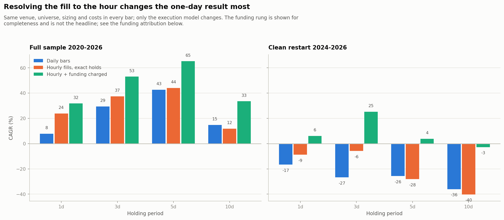

### Funding on that venue is a tail artifact

The comparison above reports the futures rows with funding excluded, which
needs justifying, because leaving out a real cost usually flatters a result and
here it does the opposite.

A long perpetual pays funding when the rate is positive and receives it when
the rate is negative. Charging it from the venue's own per-symbol series does
not shave the result, it inflates it, because this rule buys into sharp
corrections and sharp corrections are exactly when funding goes deeply
negative.

That sounds like an edge and is not one. The receipts are concentrated in a
handful of newly listed perpetuals switched to hourly funding at the negative
cap, held at position sizes that a book that thin would never have filled.
Treating them as strategy P&L would mean claiming a return stream produced by
about thirty trades in illiquid names.

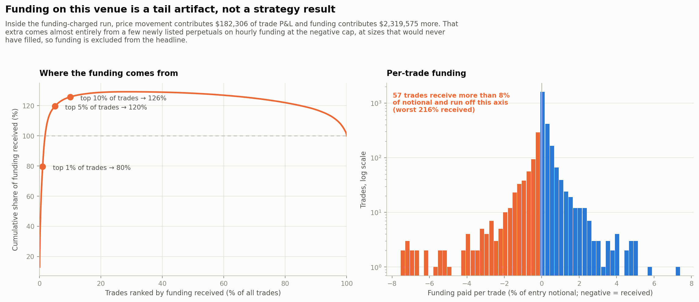

Those rows therefore report price P&L only, which is also what keeps them
comparable to the spot study above. The funding-charged variant stays visible in the
execution table above and in `funding_charged_summary.csv`. Any real attempt to
harvest this would be a different strategy with a different liquidity
constraint, and would need depth data this project does not have.

## Reconstruction hypothesis: a market-wide regime gate

The momentum-correction post mentions no regime filter. Two other posts by the
same author do: an earlier one describes "a simple regime filter" without
defining it, and a later one publishes `Buy BTC if C > MA(50)` with a chart
captioned `Close > SMA(50) Timing vs Buy & Hold`. That is enough to test a
gate, and not enough to claim the published curve used one.

The gate stands the whole book down when the reference asset closes under its
average: no new orders, and resting orders are pulled. Positions already open
run to their scheduled exit, because the rule has no stop.

| Gate | Provenance | Days in market | Total return | CAGR | Max drawdown | Clean 2024-2026 CAGR |
|---|---|---:|---:|---:|---:|---:|
| none | the frozen baseline, always in the market | 100.00% | 331.97% | 25.27% | -78.61% | -23.23% |
| C > SMA(50) | the author's published rule, verbatim | 52.17% | 1978.37% | 59.55% | -51.71% | -1.96% |
| C > SMA(50), 3d | the same rule with a confirmation window | 47.79% | 1570.71% | 54.28% | -52.28% | -5.28% |
| C > EMA(120) | longer average, no confirmation | 58.38% | 1318.62% | 50.44% | -54.57% | -3.16% |
| C > EMA(120), 3d | longer average with a confirmation window | 55.46% | 1460.19% | 52.66% | -51.95% | -6.50% |

Every gate roughly halves time in the market, multiplies the full-sample
return, and cuts maximum drawdown from -78.61% to
around -52.11%. The clean-window loss shrinks
from -23.23% to -1.96% at best. It does
not turn positive.


The account path is the plain version of the table. Through 2020 and 2021 the
gated and ungated books track each other, ending 2021 within 32% of one
another. Across 2022 the ungated book falls from $1.62M to $0.53M while the
gated books hold between $1.33M and $1.41M, and the gap never closes again.
The gate does not trade better. It declines to trade at all through the one
year that destroys the ungated book, which is also the only year where the two
differ much.

That is a real risk-management result and a weak statistical one: it rests on a
single bear market. Whether it reproduces the source is a separate question,
and the answer is partly.


The gate does what it was proposed to do. Against the digitised source curve,
the ungated rule gives back 71% of its running total across 2022 where the
source gives back 24%; the gated variants give back between 2% and 40%,
bracketing it. That is the flat stretch in the published chart, explained.

It explains nothing about the divergence that matters. From end-2024 the
source more than doubles, gaining 118%, while every variant here falls by
between 22% and 36%. Standing down in bear markets is evidently part of the
author's process, and it is not what separates this reconstruction from his
result.

Two warnings attach to every number in this section. The gate was selected
after seeing the 2024-2026 window, so those figures are a fit rather than a
test and cannot be quoted as out-of-sample evidence. And a filter keyed to one
reference asset over one bull-bear cycle has very few effective degrees of
freedom in the data: it is one decision about one market's direction,
repeated. Any forward use needs an untouched period beginning after this
report.


## Baseline trade economics

- Final equity: $431,972 from
  $100,000.
- Orders: 6,665; fills: 3,177;
  fill rate: 47.67%.
- Hit rate: 47.97%.
- Mean/median return on reserved capital:
  1.41% / -0.41%.
- Profit factor: 1.03.
- Total modeled fees: $328,396.
- Average invested capital: 49.75%;
  average capital reserved by open limits:
  40.70%.
- Daily expected shortfall: 90% -5.34%,
  95% -7.23%, 99% -13.93%.
- Missing scheduled exits charged at zero recovery:
  1; delayed exit-days:
  0.

A profit-concentration value above 100% means the best trades earned more
than total net P&L because the remaining trades lost money in aggregate.

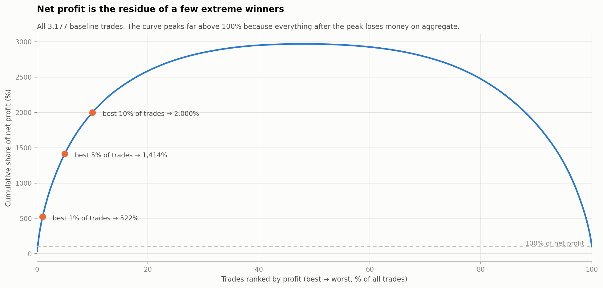

## Calendar stability

| Year | Return | Annualized volatility | Worst within-year drawdown |
|---:|---:|---:|---:|
| 2020 | 118.35% | 62.24% | -45.27% |
| 2021 | 641.39% | 74.73% | -34.32% |
| 2022 | -67.27% | 62.80% | -75.34% |
| 2023 | 50.64% | 47.76% | -71.08% |
| 2024 | 21.08% | 49.72% | -63.48% |
| 2025 | -36.27% | 47.83% | -70.83% |
| 2026 | -29.87% | 32.71% | -78.61% |

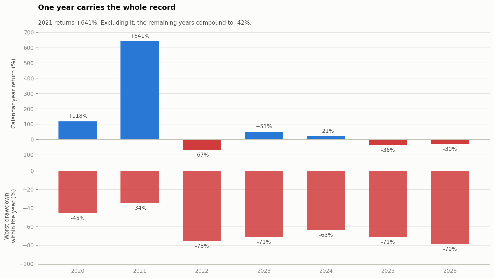

## Parameter robustness

Each cell changes only correction depth and holding period. It is reported
as a family, not searched for a replacement baseline.

| Correction sigma | Hold days | Full CAGR | OOS CAGR | OOS max drawdown | Full trades |
|---:|---:|---:|---:|---:|---:|
| 0.5 | 1 | 20.02% | -1.90% | -45.98% | 7799 |
| 0.5 | 3 | 10.03% | -41.22% | -81.70% | 5373 |
| 0.5 | 5 | 5.00% | -41.67% | -86.14% | 4307 |
| 0.5 | 10 | 19.28% | -36.67% | -81.65% | 3057 |
| 1.0 | 1 | 22.15% | 1.01% | -32.24% | 4613 |
| 1.0 | 3 | 32.84% | -23.17% | -72.29% | 3709 |
| 1.0 | 5 | 25.27% | -23.23% | -72.94% | 3177 |
| 1.0 | 10 | 11.35% | -28.17% | -82.08% | 2453 |
| 1.5 | 1 | 37.06% | 22.20% | -19.84% | 2809 |
| 1.5 | 3 | 55.82% | 9.71% | -41.28% | 2437 |
| 1.5 | 5 | 34.86% | 1.59% | -50.26% | 2167 |
| 1.5 | 10 | 16.96% | -10.67% | -77.74% | 1825 |
| 2.0 | 1 | 30.27% | 17.96% | -16.99% | 1660 |
| 2.0 | 3 | 54.68% | 22.78% | -24.04% | 1533 |
| 2.0 | 5 | 27.61% | 27.99% | -33.21% | 1421 |
| 2.0 | 10 | 14.08% | -6.85% | -59.57% | 1270 |

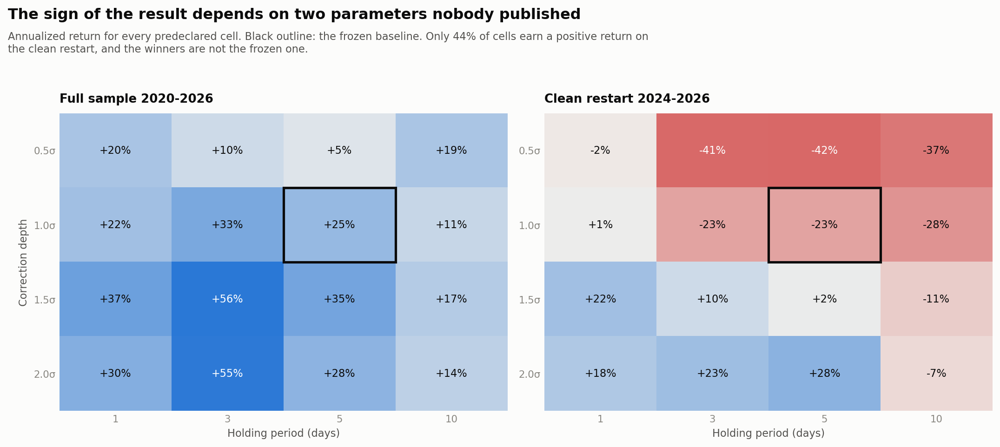

The positive deep-correction cells are a new hypothesis discovered on the
same 2024-2026 evaluation period. Switching to one now would convert that
period into training data. Any such variant needs an untouched forward
shadow period beginning after this report.

## Friction stress

Round-trip bps combine modeled fees and market-order slippage. A resting
limit never receives positive price improvement.

| Scenario | Round-trip bps | CAGR | Max drawdown | Total fees |
|---|---:|---:|---:|---:|
| zero-cost diagnostic | 0 | 37.19% | -73.28% | $0 |
| baseline | 25 | 25.27% | -78.61% | $328,396 |
| 50 bps round trip | 50 | 13.21% | -85.79% | $341,140 |
| 100 bps round trip | 100 | -5.63% | -93.74% | $325,915 |

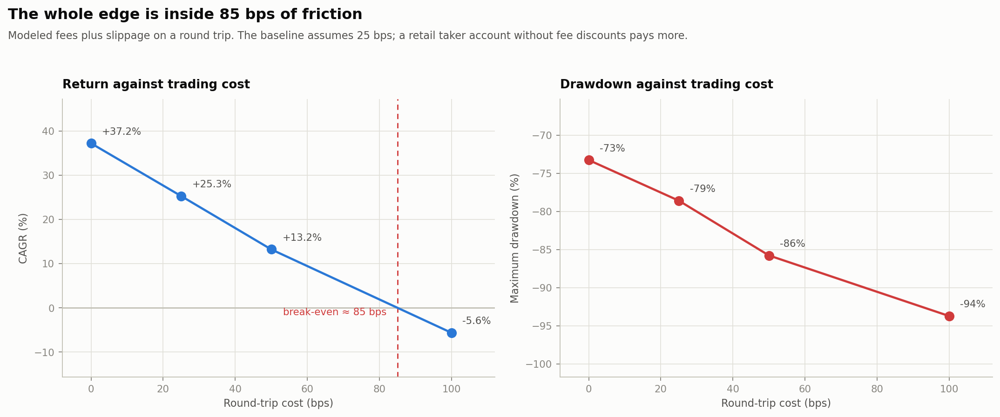

## Sampling uncertainty

The moving-block bootstrap resamples 30-day blocks and therefore preserves
some volatility clustering:

- CAGR 95% interval:
  -60.88% to 51.79%;
  median -25.09%.
- Maximum-drawdown 95% range:
  -92.32% to -40.36%;
  median -72.21%.

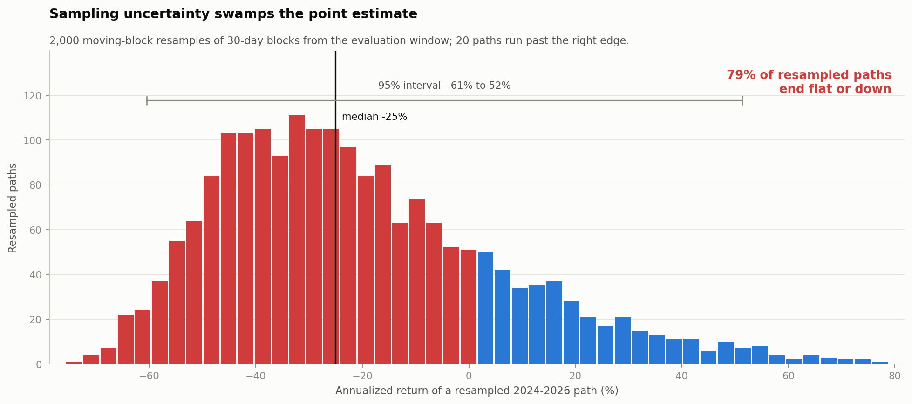

This interval measures path uncertainty conditional on the observed sample.
It does not cover exchange failure, delisting liquidation, regime change, or
model misspecification.

## Live-trading gate

Do not enable order submission until all of these have passed:

1. Run `scripts/live_plan.py` read-only every UTC close for at least 60 days.
2. Shadow every planned order against trade and depth streams; measure
   trade-through fill rate, queue delay, partial fills, spread, and exit
   slippage.
3. Re-run the backtest with the measured execution model and actual account
   commissions.
4. Reconcile balances, open orders, and positions before reserving capital.
5. Enforce current tick, lot-size, min/max notional, order-count, and
   maximum-position filters from `/api/v3/exchangeInfo`.
6. Use unique client order IDs and persist the order state machine before
   sending anything. A timeout or HTTP 5xx leaves execution status unknown;
   query order status before retrying.
7. Add stale-data, clock-skew, WebSocket-gap, API-rate-limit, and kill-switch
   controls. Binance documents 429 backoff and possible 418 IP bans in the
   [official REST documentation](https://developers.binance.com/en/docs/products/spot/rest-api).
8. Start with a manually approved canary allocation no larger than 10% of
   the intended per-coin risk. Increase only after realized execution agrees
   with the shadow model.

The included live-plan tool is deliberately unable to place orders.
[Official order documentation](https://github.com/binance/binance-spot-api-docs/blob/master/rest-api.md)
shows that live order endpoints are signed and require `TRADE` permission.
API credentials should not be added to this research project.

## Reproduction

```bash
python -m pip install -r requirements.txt
make test
make discover download parse backtest
make live-plan
```

The report outputs are under `results/`; raw archives and parsed parquet
files are intentionally ignored by Git.
